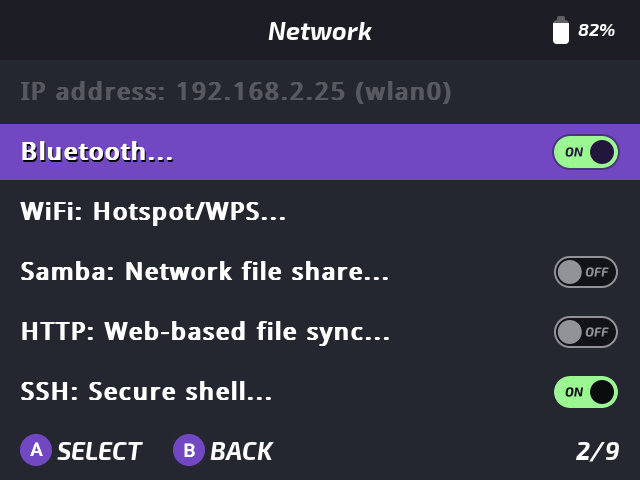
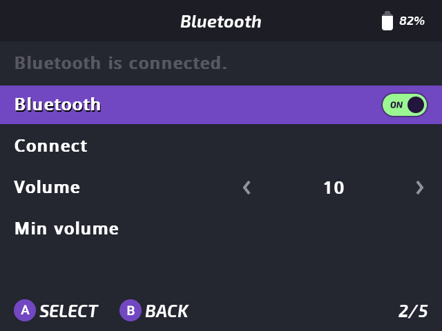
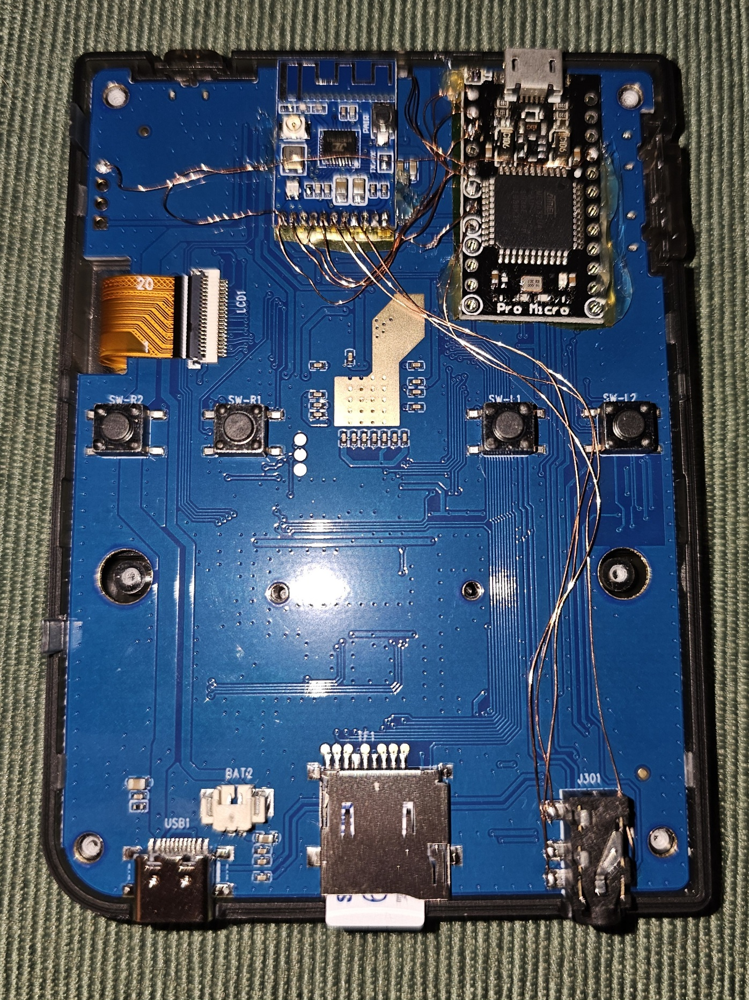

# Miyoo Mini Plus Bluetooth Mod firmware

The goal of this project is to add Bluetooth functionality to the Miyoo Mini Plus without cutting into the casing, keeping the stock look.
To achieve this a microcontroller is added between the Bluetooth chip and the Miyoo Mini Plus.

This repository contains the code that runs on the microcontroller (ATmega32u4).
The microcontroller software essentially acts as a bridge between the KCX_BT_Emitter (UART) and the Miyoo Mini Plus (I2C).

## Power

The KCX_BT_Emitter and the microcontroller are fed by the battery directly, this is needed because the KCX_BT_Emitter won't power on with a lower voltage (3v or 3v3).

This means that both are essentially always powered. To avoid excessive power drain the lower power features of the KCX_BT_Emitter and the ATmega32u4 are used when Bluetooth isn't used or when the system is turned off.

## KCX_BT_Emitter communication

Communication with the KCX_BT_Emitter is achieved by using:
- AT UART interface.
- CON pin (wake from sleep).

## Miyoo Mini Plus communication

Communication with the Miyoo Mini Plus is not trivial due to missing software drivers (kernel and device tree overlay).
This limits the communication to I2C as this is already used for the PMIC (AXP223).

So it uses:
- I2C as the main communication method.
- A 3v input originating from DCDC1 (LX1) pin on the AXP223.
    - This is used to detect when the system is powered.
- Headphone control (Enable headphone output when Bluetooth device is connected).

## OnionOS software

Applications for configuring are available here: [https://github.com/MagneFire/Onion/tree/f/bluetooth-app](https://github.com/MagneFire/Onion/tree/f/bluetooth-app).
Essentially it contains two new applications: `kcx` and `bluetooth`.
- `kcx` is a command line application that allows for quick configuration via SSH or telnet.
- `bluetooth` is a modified version of the `tweaks` application that adds Bluetooth related options (Power, connection and volume).

| Network | Bluetooth |
| ------- |  -------  |
|  |  |

## Hardware mod

The KCX_BT_Emitter and the Arduino Pro Micro are placed on the back, above the triggers.

## Resouces

- Original mod: [https://www.reddit.com/r/MiyooMini/comments/15q2mdi/finally_i_got_my_mmp_bluetooth_enabled/](https://www.reddit.com/r/MiyooMini/comments/15q2mdi/finally_i_got_my_mmp_bluetooth_enabled/)
- KCX_BT_Emitter forum with datasheets: [https://www.electro-tech-online.com/threads/kcx_bt_emitter-low-cost-bluetooth-bt-audio-module.158156/](https://www.electro-tech-online.com/threads/kcx_bt_emitter-low-cost-bluetooth-bt-audio-module.158156/)
- KCX_BT_Emitter example code and additional information: [https://github.com/Mark-MDO47/BluetoothAudioTransmitter_KCX_BT_EMITTER](https://github.com/Mark-MDO47/BluetoothAudioTransmitter_KCX_BT_EMITTER)